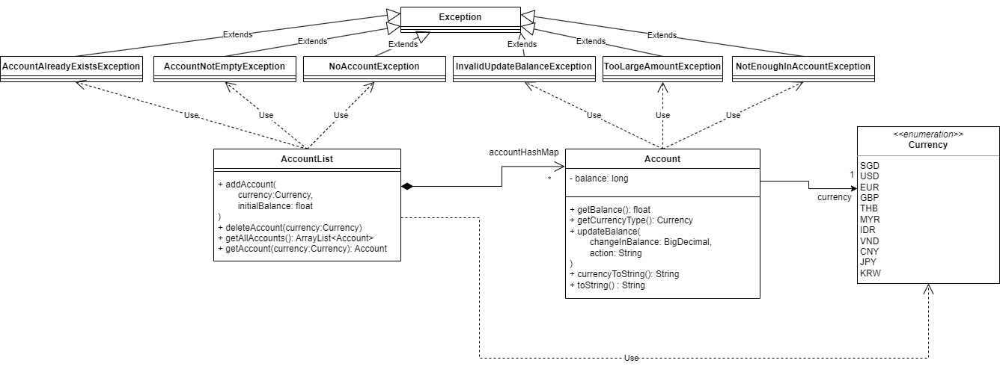

# Developer Guide

<!-- TOC -->

* [Developer Guide](#developer-guide)
    * [Acknowledgements](#acknowledgements)
    * [Setting up, getting started](#setting-up-getting-started)
    * [Design](#design)
        * [Architecture](#architecture)
        * [UI component](#ui-component)
        * [Parser component](#parser-component)
        * [AccountList Component](#accountlist-component)
        * [Forex component](#forex-component)
    * [Implementation](#implementation)
        * [Create-account feature](#create-account-feature)
        * [Delete-account feature](#delete-account-feature)
        * [Add/Withdraw feature](#addwithdraw-feature)
        * [View balance feature](#view-balance-feature)
        * [Show-rate feature](#show-rate-feature)
        * [Money exchange feature](#money-exchange-feature)
    * [Appendix: Requirements](#appendix--requirements)
        * [Product scope](#product-scope)
        * [Target user profile](#target-user-profile)
        * [Value proposition](#value-proposition)
        * [User Stories](#user-stories)
        * [Non-Functional Requirements](#non-functional-requirements)
        * [Glossary](#glossary)
    * [Appendix: Instructions for manual testing](#appendix--instructions-for-manual-testing)

<!-- TOC -->

## Acknowledgements

{list here sources of all reused/adapted ideas, code, documentation, and third-party libraries -- include links to the
original source as well}

## Setting up, getting started

## Design

### Architecture

## Product scope

### UI component

### Parser component

### Accounts Component

Here is a class diagram of the Accounts component

The `Accounts` Component

* Stores the `AccountList` which contains all the user's accounts
* `AccountList` handles all logic dealing with accounts
* `Account` stores both its currency type and its balance
* There can be only one `Currency` per `Account`
* There can be only one `Account` of each `Currency`

### Forex component

## Implementation

### Create-account feature

The create account feature is facilitated by `AccountList` Class within the `Accounts` Component  
The method called from `AccountList` is the `addAccount` method which creates a new `Account` object  
The current implementation initialises the `Account` with 0 balance

Given below is an example of the usage of the Create Account feature and the mechanism at each step

Step 1: The user launches the application for the first time and `AccountList` is created with no `Account`'s

Step 2: The user passes in the command `create-account <CURRENCY>`, where `CURRENCY` is a valid string representing one
of the elements of the `Currency` enum

Step 3: The user passes in the command `create-account <CURRENCY>`, where `CURRENCY` is also valid but different to that
in step 1.

The following sequence diagram shows how the Create Account operation works

### Delete-account feature

### Add/Withdraw feature

### View balance feature

### Show-rate feature

### Money exchange feature

## Appendix: Requirements

### Product scope

### Target user profile

{Describe the target user profile}

### Value proposition

{Describe the value proposition: what problem does it solve?}

### User Stories

| Version | As a ... | I want to ...             | So that I can ...                                           |
|---------|----------|---------------------------|-------------------------------------------------------------|
| v1.0    | new user | see usage instructions    | refer to them when I forget how to use the application      |
| v2.0    | user     | find a to-do item by name | locate a to-do without having to go through the entire list |

### Non-Functional Requirements

{Give non-functional requirements}

### Glossary

* *glossary item* - Definition

## Appendix: Instructions for manual testing

{Give instructions on how to do a manual product testing e.g., how to load sample data to be used for testing}
