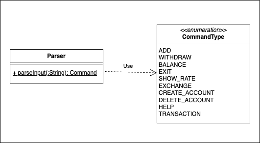
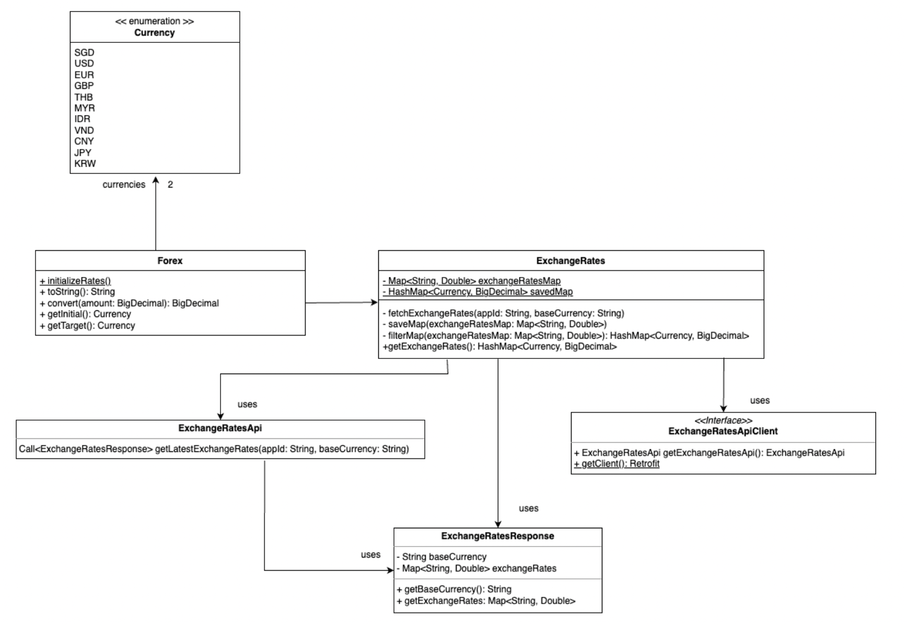
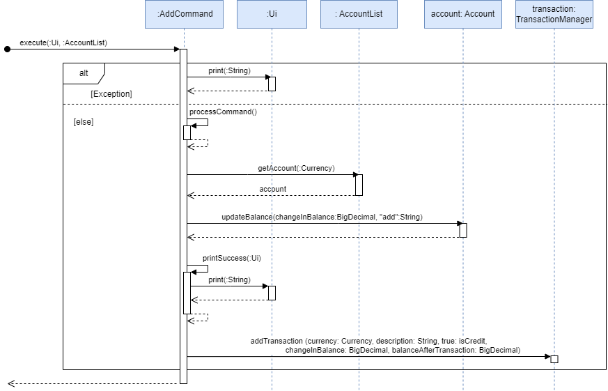
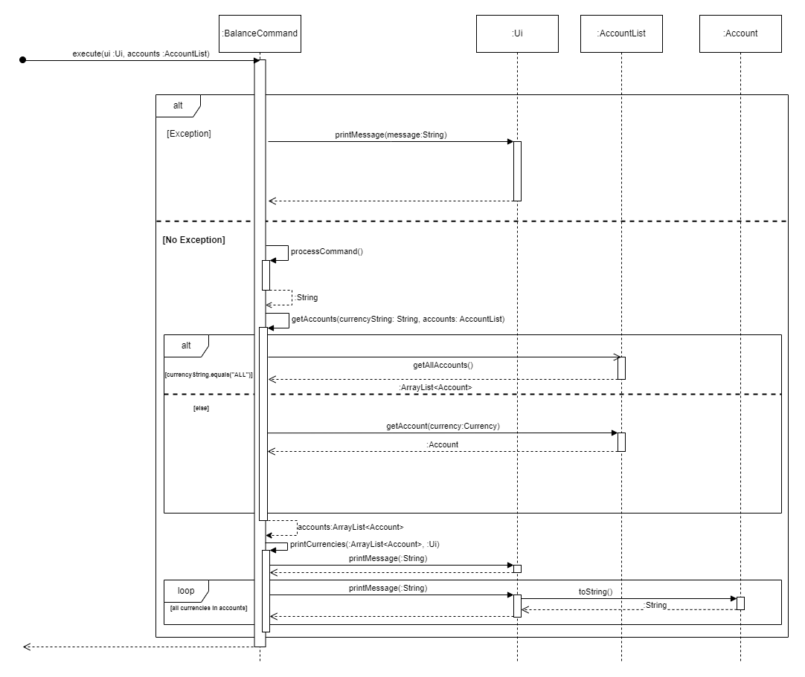

# Developer Guide

<!-- TOC -->

- [Developer Guide](#developer-guide)
    - [Acknowledgements](#acknowledgements)
    - [Setting up](#setting-up)
        - [Setting up the project in your computer](#setting-up-the-project-in-your-computer)
        - [Before writing code](#before-writing-code)
    - [Design](#design)
        - [Architecture](#architecture)
        - [General Sequence](#general-sequence)
        - [UI component](#ui-component)
        - [Parser component](#parser-component)
        - [Accounts Component](#accounts-component)
        - [Forex component](#forex-component)
    - [Implementation](#implementation)
        - [Create/Delete account feature](#createdelete-account-feature)
        - [Delete-account feature](#delete-account-feature)
        - [Add/Withdraw money feature](#addwithdraw-money-feature)
        - [View balance feature](#view-balance-feature)
        - [Show-rate feature](#show-rate-feature)
        - [Money exchange feature](#money-exchange-feature)
    - [Appendix: Requirements](#appendix--requirements)
        - [Product scope](#product-scope)
        - [Target user profile](#target-user-profile)
        - [Value proposition](#value-proposition)
        - [User Stories](#user-stories)
        - [Non-Functional Requirements](#non-functional-requirements)
        - [Glossary](#glossary)
    - [Appendix: Instructions for manual testing](#appendix--instructions-for-manual-testing)
  <!-- TOC -->

## Acknowledgements

{list here sources of all reused/adapted ideas, code, documentation, and third-party libraries -- include links to the
original source as well}

## Setting up

### Setting up the project in your computer

First, **fork** this repo, and **clone** the fork into your computer.
If you plan to use Intellij IDEA (highly recommended):

1. **Configure the JDK**: Follow the guide [_[se-edu/guides] IDEA: Configuring the
   JDK_](https://se-education.org/guides/tutorials/intellijJdk.html) to ensure Intellij is configured to use **JDK 11
   **.
2. **Import the project as a Gradle project**: Follow the guide [_[se-edu/guides] IDEA: Importing a Gradle
   project_](https://se-education.org/guides/tutorials/intellijImportGradleProject.html) to import the project into
   IDEA. 
   :exclamation: Note: Importing a Gradle project is slightly different from importing a normal Java project.
3. **Verify the setup**:
    1. Run the `seedu.duke.Duke` and try a few commands.
    2. Run the tests using `./gradlew check` to ensure they all pass.

---

### Before writing code

1. **Configure the coding style**
   If using IDEA, you can use the following steps to import the code style settings.
    1. Go to `File → Settings → Editor → Code Style`
    2. Click the Gear Icon next to the `Scheme` box and then click `Import Scheme → IntelliJ IDEA code style XML`.
    3. Select the `DefaultCodeStyle.xml` file in the root of the project directory.
2. **Set up CI**
   This project comes with a GitHub Actions config files (in `.github/workflows` folder). When GitHub detects those
   files, it will run the CI for your project automatically at each push to the `master` branch or to any PR. No set up
   required.
3. **Learn the design**
   When you are ready to start coding, we recommend that you get some sense of the overall design by reading
   about [MoneyMoover’s architecture](DeveloperGuide.md#architecture).

When you are ready to start coding, we recommend that you get some sense of the overall design by reading
about [MoneyMoover’s architecture](DeveloperGuide.md#architecture).

## Design

### Architecture

The diagram above provides a high-level overview of how the project is structured. The main components are:

1. The `Main` class which initialises all the other components at startup, and connects them with each other
2. The `UI` component which is responsible for all user input and output
3. The `Parser` component which parses user input and creates the relevant Command objects
4. The `Command` component which executes the logic
5. The `Accounts` component which manages the user's accounts
6. The `Forex` (Foreign Exchange) component which handles exchange-rate related logic
7. The `Transactions` component which manages the user's transactions
8. The `Storage` component which handles the saving and loading of data to disk

### General Sequence

The following is a high-level sequence of a single `create-account SGD` command, which demonstrates how the components
interact with each other:

### UI component

The API of this component is specified in the `Ui.java`.

The UI class deals with the user interaction with the application, which includes the printing and the logic to read in
inputs. We will pass in the instance of UI into the `execute` method of the `Command` class. The main features includes:

- Printing text such as new line, spacer, farewell message, greeting message.

- Empowers the users to print customised message in `printf` and `printMessage` method.

- Reads in the user input as `String`.

### Parser component

The `Parser` Component

- Parses the user input and creates the relevant `Command` object
- Makes use of the `CommandType` enum to determine the type of command to create

### Accounts Component

Here is a class diagram of the `Accounts` component

The `Accounts` Component

- Stores the `AccountList` which contains all the user's accounts
- `AccountList` handles all logic dealing with accounts
- `Account` stores both its currency type and its balance
- There can be only one `Currency` per `Account`
- There can be only one `Account` of each `Currency`

### Forex component

Here is a class diagram of the `Forex` component

The `Forex` Component

- Stores the exchange rates of 1 SGD to all supported currencies in a hash map
- Each `Forex` object represents the relationship between two currencies
- `convert` can be called on a `Forex` object to convert an amount using the relationship
- Each `Forex` object has an initial and target `Currency`
- There is only one instance of the `exchangeRates` hash map.

The `Currency` Enum

- Keeps all currency types supported by the exchange
- Exchange rates are manually pulled from https://www.xe.com/currencyconverter/convert
- Each `Forex` instance must have two `Currency` associated with it

### Open Exchange Rates API

When MoneyMoover starts, the Forex class calls its static method initializeRates(). This method calls the constructor
of the ExchangeRates class, then sleeps for 5 seconds, then retrieves the HashMap that ExchangeRates has created
from the method fetchExchangeRates within its constructor. Forex copies the HashMap and uses it for the rest of the user
session.

fetchExchangeRates retrieves a Retrofit instance from the ExchangeRatesApiClient class, and uses it to create
an instance of the ExchangeRatesApi, an interface that defines the methods for retrieving the exchange rates
data from Open Exchange Rates API.

fetchExchangeRates then makes a call to getLatestExchangeRates to retrieve the exchange rates using the ExchangeRatesApi
instance,
and a base currency of USD, and our API token from Open Exchange Rates.

getLatestExchangeRates returns a Call object, and we enqueue a Callback object to get the onResponse() and onFailure()
methods
that will be called depending on the outcome of the Call. If the call is successful, onResponse() returns an
ExchangeRatesResponse object containing the HashMap of ISO currency tags as Strings for keys, and doubles for rates.
This data
is then extracted using saveMap, which filters out the rates for our supported currencies and performs type conversion.
The savedMap attribute of ExchangeRates is set to this filtered map, which is then passed to Forex via getExchangeRates.

If onFalire() is called, it means an unexpected error was encountered, such as losing Internet connection.

Below is a UML Diagram of the classes and their respective methods.

### Transactions Component

Here is a class diagram of the `Transactions` component

The `Transactions` component

- A `Transaction` is recorded upon every command that changes the balance of an account
- Certain commands allow the provision of a description parameter to associate a custom description to a transaction
- `Transactions` are only accessed through the `TransactionManager`
- `Transactions` associated to an account are deleted if and only if the account is deleted

## Implementation

### Create/Delete account feature

This feature is facilitated by `AccountList` Class within the `Accounts` Component.
The method called from `AccountList` is the `addAccount` method which creates a new `Account` object.The `deleteAccount`
method called from `AccountList` delete the specified `Account` object.

The current implementation initialises the `Account` with 0 balance.
Only currency account which 0 balance can be deleted.

Given below is an example of the usage of this feature and the mechanism at each step

Step 1: The user launches the application for the first time and `AccountList` is created with no `Account`

Step 2: The user passes in the command `create-account <CURRENCY>`, where `CURRENCY` is a valid string representing one
of the elements of the `Currency` enum

Step 3: The user passes in the command `create-account <CURRENCY>`, where `CURRENCY` is also valid but different to that
in step 1.

Step 4: The user passes the command `delete-account CURRENCY`, for example `delete-account SGD`.

The following sequence diagram shows how the Create Account operation works

### Delete-account feature

### Add/Withdraw money feature

The add money(deposit) and withdraw money feature is facilitated by `AddCommand` and `WithdrawCommand` which both
extends the `Command` class. With the provided input from user (`CURRENCY` and `AMOUNT`), `AddCommand`
and `WithdrawCommand`
update the balance of respective currency account accordingly.

Step 1. The newly created `SGD` account has an initial balance of 0

Step 2. The user passes command `add CURRENCY AMOUNT` (eg. `add SGD 100`), where `CURRENCY` must be one of the available
currency and `AMOUNT` must be positive numbers.

Step 3. The user passes command `withdraw` (eg. `withdraw SGD 25`), where `AMOUNT` must be smaller than the currency
account balance.

The following sequence diagram shows how the add money operation works.

The following sequence diagram shows how the money withdrawal operation works.

### View balance feature

The view balance feature is facilitated using `Account` instances stored within the `AccountList` object. The main
functionality is to view the balance of a specific currency if the currency is specified, else view all the currencies
in the account.

### Show-rate feature

The exchange feature is facilitated using two `Forex` instances to represent the
exchange rates between two currencies. The current implementation reads manual exchange
rates from an online source. Future implementation will use an API to maintain up-to-date
exchange rates.

Exchange rate source: https://www.xe.com/currencyconverter/convert

The show-rate command executes as follows

- The initial and target currency are parsed from the input
- If the user included an amount, the amount is also parsed
- A `Forex` object showing the rate from the initial to the target currency is made
- A `Forex` object showing the rate from the target to the initial currency is made
- The Ui prints the exchanged amount if an amount was provided by the user for both rates
- The Ui will print the unit rate both ways if no amount was provided

The following sequence diagram shows how the Show Rate command works

### Money exchange feature

The exchange feature is facilitated using `Account` instances stored within an `AccountList`
object. The main functionality is facilitated by the `convert` function within the `Forex`
component. The current implementation reads manual exchange rates from an online source. Future
implementation will use an API to maintain up-to-date exchange rates. An exchange call will produce two
transaction activity. A debit transaction will reflect on initial account and credit transaction will
reflect on target account

Exchange rate source: https://www.xe.com/currencyconverter/convert

This command is executed under the assumption that an `Account` for both the initial and target
currencies exist. To avoid redundancy, please see the `create-account` feature in the developer
guide for more specific steps on how `Accounts` are created.

The exchange command executes as follows:

- Initial and target currencies are parsed from the user input
- A Forex object is created using the parsed currencies (see `Forex` component for more information)
- The amount to be exchanged is parsed from the user input
- The `Accounts` for both currencies are retrieved
- The converted value is calculated using the `Forex` object
- The value of the initial `Account` is updated
- The value of the target `Account` is updated
- The new balances are printed

The following sequence diagram shows how the Exchange command works

### Show transactions feature

The show transactions feature is facilitated by `TransactionCommand`, extending from the `Command` class.
Since any one user might have many transactions, flags are used to specify search parameters for the command.

The Transaction command executes as follows:

- The command is parsed to determine if there are additional search parameters
- Interaction with the `TransactionManager` to retrieve relevant accounts
- The relevant transactions are printed

The following sequence diagram shows how the Transaction command works

## Appendix: Requirements

### Product scope

### Target user profile

- Students who are planning to travel overseas
- People who need to exchange money for travel
- People who are comfortable using a CLI

### Value proposition

MoneyMoover is a **CLI application for managing and transferring international currencies**, optimized for use via a
Command Line Interface (CLI) while still having the features of other money management applications.

### User Stories

| Version | As a ... | I want to ...             | So that I can ...                                           |
|---------|----------|---------------------------|-------------------------------------------------------------|
| v1.0    | new user | see usage instructions    | refer to them when I forget how to use the application      |
| v2.0    | user     | find a to-do item by name | locate a to-do without having to go through the entire list |

### Non-Functional Requirements

{Give non-functional requirements}

### Glossary

- _glossary item_ - Definition

## Appendix: Instructions for manual testing

{Give instructions on how to do a manual product testing e.g., how to load sample data to be used for testing}
