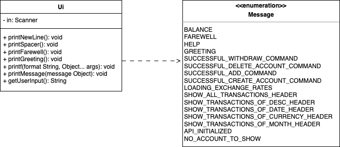
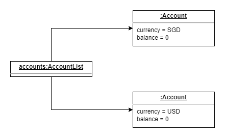
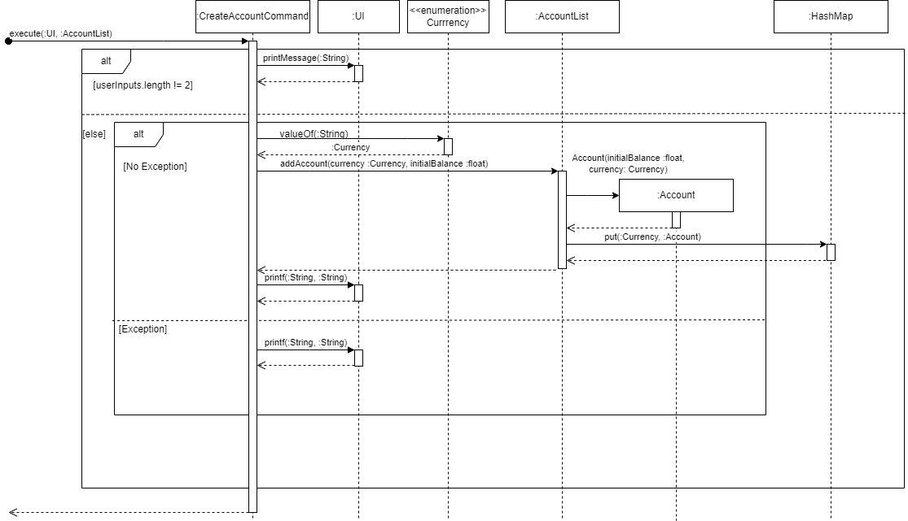

# Developer Guide

<!-- TOC -->

* [Developer Guide](#developer-guide)
    * [Acknowledgements](#acknowledgements)
    * [Setting up, getting started](#setting-up-getting-started)
    * [Design](#design)
        * [Architecture](#architecture)
    * [Product scope](#product-scope)
        * [UI component](#ui-component)
        * [Parser component](#parser-component)
        * [Accounts Component](#accounts-component)
        * [Forex component](#forex-component)
    * [Implementation](#implementation)
        * [Create-account feature](#create-account-feature)
        * [Delete-account feature](#delete-account-feature)
        * [Add/Withdraw money feature](#addwithdraw-money-feature)
        * [View balance feature](#view-balance-feature)
        * [Show-rate feature](#show-rate-feature)
        * [Money exchange feature](#money-exchange-feature)
    * [Appendix: Requirements](#appendix--requirements)
        * [Product scope](#product-scope-1)
        * [Target user profile](#target-user-profile)
        * [Value proposition](#value-proposition)
        * [User Stories](#user-stories)
        * [Non-Functional Requirements](#non-functional-requirements)
        * [Glossary](#glossary)
    * [Appendix: Instructions for manual testing](#appendix--instructions-for-manual-testing)

<!-- TOC -->

## Acknowledgements

{list here sources of all reused/adapted ideas, code, documentation, and third-party libraries -- include links to the
original source as well}

## Setting up, getting started

## Design

### Architecture

## Product scope

### UI component

The API of this component is specified in the `Ui.java`.

The UI class deals with the user interaction with the application, which includes the printing and the logic to read in
inputs. We will pass in the instance of UI into the `execute` method of the `Command` class. The main features includes:

1. Printing text such as new line, spacer, farewell message, greeting message.

2. Empowers the users to print customised message in `printf` and `printMessage` method.

3. Reads in the user input as `String`.

### Parser component

### Accounts Component

Here is a class diagram of the Accounts component

The `Accounts` Component

- Stores the `AccountList` which contains all the user's accounts
- `AccountList` handles all logic dealing with accounts
- `Account` stores both its currency type and its balance
- There can be only one `Currency` per `Account`
- There can be only one `Account` of each `Currency`

### Forex component

## Implementation

### Create/Delete account feature

This feature is facilitated by `AccountList` Class within the `Accounts` Component  
The method called from `AccountList` is the `addAccount` method which creates a new `Account` object  
The current implementation initialises the `Account` with 0 balance

Given below is an example of the usage of the Create Account feature and the mechanism at each step

Step 1: The user launches the application for the first time and `AccountList` is created with no `Account`'s

Step 2: The user passes in the command `create-account <CURRENCY>`, where `CURRENCY` is a valid string representing one
of the elements of the `Currency` enum

Step 3: The user passes in the command `create-account <CURRENCY>`, where `CURRENCY` is also valid but different to that
in step 1.

The following sequence diagram shows how the Create Account operation works

### Delete-account feature

### Add/Withdraw money feature

The add money(deposit) and withdraw money feature is facilitated by `AddCommand` and `WithdrawCommand` which both
extends the `Command` class. With the provided input from user (`CURRENCY` and `AMOUNT`),  `AddCommand`
and `WithdrawCommand`
update the balance of respective currency account accordingly.

Step 1. The newly created `SGD` account has an initial balance of 0

Step 2. The user passes command `add CURRENCY AMOUNT` (eg. `add SGD 100`), where `CURRENCY` must be one of the available
currency and `AMOUNT` must be non-zero

Step 3. The user passes command `withdraw` (eg. `withdraw SGD 25`), where `AMOUNT` must be smaller than the currency
account balance

The following sequence diagram shows how the add money operation works

The following sequence diagram shows how the money withdrawal operation works

### View balance feature

### Show-rate feature

### Money exchange feature

## Appendix: Requirements

### Product scope

### Target user profile

{Describe the target user profile}

### Value proposition

{Describe the value proposition: what problem does it solve?}

### User Stories

| Version | As a ... | I want to ...             | So that I can ...                                           |
|---------|----------|---------------------------|-------------------------------------------------------------|
| v1.0    | new user | see usage instructions    | refer to them when I forget how to use the application      |
| v2.0    | user     | find a to-do item by name | locate a to-do without having to go through the entire list |

### Non-Functional Requirements

{Give non-functional requirements}

### Glossary

- _glossary item_ - Definition

## Appendix: Instructions for manual testing

{Give instructions on how to do a manual product testing e.g., how to load sample data to be used for testing}
