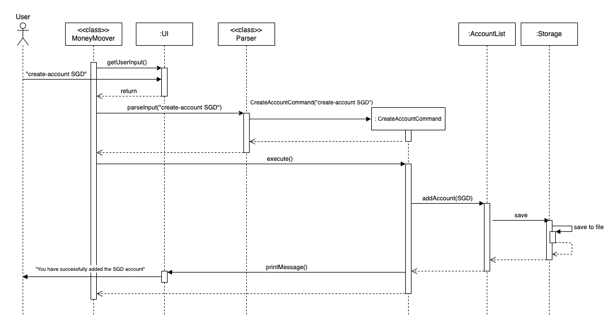

# Wen Jun Personal Portfolio Page

## Overview

MoneyMoover is a **CLI application for managing and transferring international currencies**, optimized for use via a Command Line Interface (CLI) while still having the features of other money management applications.

Our app will help students to **track their expenses and income** in order to stay within their budgets, so that they have enough money to travel. It will also help them convert to foreign currencies so they can see how much they have to spend overseas.

## Summary of Contributions

-   Code Contributed: [RepoSense Link](https://nus-cs2113-ay2223s2.github.io/tp-dashboard/?search=woowenjun99&sort=groupTitle&sortWithin=title&timeframe=commit&mergegroup=&groupSelect=groupByRepos&breakdown=true&checkedFileTypes=docs~functional-code~test-code~other&since=2023-02-17)

### UI Class

I am in charge of writing the `UI Class` which is used to mainly handle the User Interface aspect. This includes reading in input, printing message and printing formatted strings. It mainly hides the complex features so that the other developers can get the intended input.

### Balance Command

I am in charged of writing the `BalanceCommand` class for the project. This class is mainly used to show the balance in a specific account or all the accounts depending on the parameters provided.

### Add Command

I am in charge of 

### Contributions to team-based tasks

-   I was responsible for the initial translation of User Stories into
    issues and delegation of work to different members of the team
-   I advocated for the use of PR templates to ensure that all PRs were consistent, easy to review and passed
    all the necessary checks
-   I proposed the usage of the BigDecimal library for floating point arithmetic, which was used in the
    implementation of many features in the application.

### Community

-   PRs reviewed
    [#39](https://github.com/AY2223S2-CS2113-T13-1/tp/pull/39)
    [#98](https://github.com/AY2223S2-CS2113-T13-1/tp/pull/98)
    [#104](https://github.com/AY2223S2-CS2113-T13-1/tp/pull/104)

-   Suggestions for other teams
    [Food Supply Tracker](https://github.com/nus-cs2113-AY2223S2/tp/pull/9),
    [WellNUS++](https://github.com/bawfen/ped/issues)

### Documentation

-   Developer Guide
    -   Added Architecture section and architecture diagram.
    -   Added General Sequence section, providing a high-level overview of how the program processes a single command.
    -   Added Parser section

##### Architecture

The diagram above provides a high-level overview of how the project is structured. The main components are:

1. The `Main` class which initialises all the other components at startup, and connects them with each other
2. The `UI` component which is responsible for all user input and output
3. The `Parser` component which parses user input and creates the relevant Command objects
4. The `Command` component which executes the logic
5. The `Accounts` component which manages the user's accounts
6. The `Forex` (Foreign Exchange) component which handles exchange-rate related logic
7. The `Transactions` component which manages the user's transactions
8. The `Storage` component which handles the saving and loading of data to disk

##### General Sequence

The following is a high-level sequence of a single `create-account SGD` command, which demonstrates how the components
interact with each other:

##### Parser component

The `Parser` Component

-   Parses the user input and creates the relevant `Command` object
-   Makes use of the `CommandType` enum to determine the type of command to create
